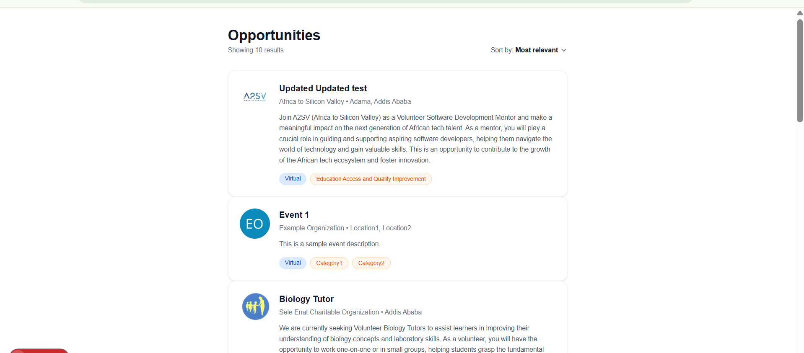
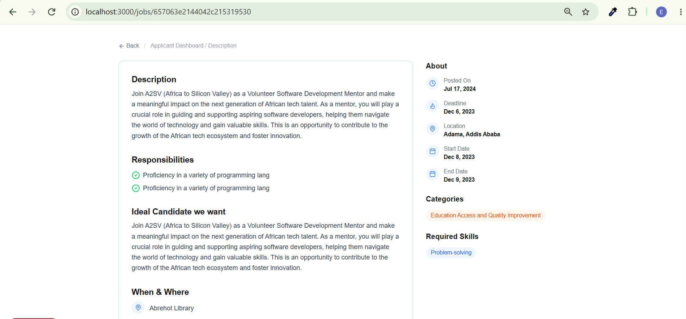

# Job Listing Application

A responsive job listing web app built with Next.js, React, TypeScript, and Tailwind CSS. Fetches live job opportunities from the A2SV API and displays them on a dashboard with a detailed view for each listing.

## Features

- **Opportunities Dashboard** — live job listings fetched from the API, shown as cards with company logo, title, location, description preview, and tags
- **Sort dropdown** — reorder listings by "Most relevant," "Newest," or "Title A–Z"
- **Job Details Page** — full description, responsibilities, ideal candidate profile, and sidebar with dates, categories, and required skills — fetched by ID from the API
- **Back navigation** — return from a job's detail page to the dashboard
- **Loading, error, and empty states** — handles failed requests and missing data gracefully
- Fully styled with Tailwind CSS, matching the provided Figma design

## Tech Stack

- [Next.js](https://nextjs.org/) 16 (App Router)
- React + TypeScript
- Tailwind CSS
- [lucide-react](https://lucide.dev/) for icons

## API Integration

Job data is fetched live from the A2SV Job-posting API:

- Base URL: `https://a2sv-akil.onrender.com`
- `GET /opportunities/search` — list of opportunities, used on the dashboard
- `GET /opportunities/:id` — single opportunity, used on the details page

Raw API responses are converted into the app's internal `Job` type via an adapter function in `app/lib/api.ts`, so UI components never depend on the API's raw field names directly.

### Error handling

- Dashboard shows a loading state while fetching, a clear error message if the request fails, and an empty state if no jobs are returned.
- The details page returns a proper 404 (`notFound()`) if the job ID doesn't exist or the request fails.

## Getting Started

```bash
npm install
npm run dev
```

Then open [http://localhost:3000](http://localhost:3000) in your browser.

## Pages

### 1. Opportunities Dashboard (`/`)

Lists all live job openings as cards, fetched from the API. Each card shows the company logo, job title, company name, location, a short description, and tags for job type and category. Includes a sort dropdown in the top right.



### 2. Job Details Page (`/jobs/[id]`)

Clicking any job card navigates here, fetching that specific job by ID from the API. Shows the full job description, a checklist of responsibilities, the ideal candidate profile, and onboarding details. The sidebar lists key dates, categories, and required skills.



## Project Structure

```
app/
├── components/
│ ├── JobCard.tsx # Individual job card used on the dashboard
│ └── SortDropdown.tsx # Client-side sort control for the dashboard
├── lib/
│ └── api.ts # Fetch functions + API-to-Job data adapter
├── types/
│ └── job.ts # Job TypeScript interface
├── jobs/
│ └── [id]/
│ └── page.tsx # Dynamic job details page (fetches by ID)
├── layout.tsx
└── page.tsx # Dashboard (fetches and displays opportunities)
```

## Notes

- Job data is fetched live from the API (earlier versions of this project used static dummy data).
- Avatar/logo images are sourced from the API response, with a fallback placeholder if missing.