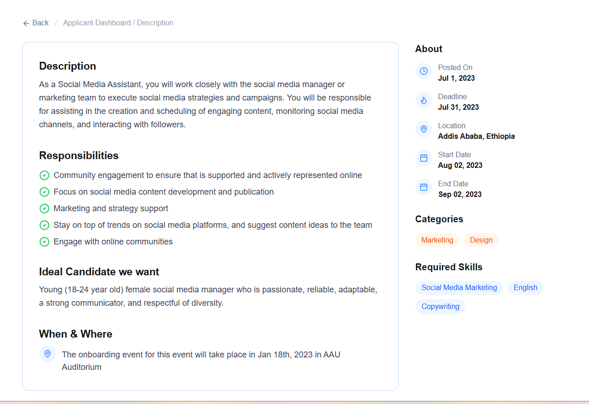

# Job Listing Application

A responsive job listing web app built with Next.js, React, TypeScript, and Tailwind CSS. Users can browse open positions on a dashboard and click into any listing to view full details.

## Features

- **Opportunities Dashboard** — browse all job listings as cards, showing company, location, a description preview, and category tags
- **Sort dropdown** — reorder listings by "Most relevant," "Newest," or "Title A–Z"
- **Job Details Page** — full description, responsibilities, ideal candidate profile, and a sidebar with posting dates, categories, and required skills
- **Back navigation** — return from a job's detail page to the dashboard
- **Avatar images** — each listing displays a company avatar
- Fully styled with Tailwind CSS, matching the provided Figma design

## Tech Stack

- [Next.js](https://nextjs.org/) 16 (App Router)
- React + TypeScript
- Tailwind CSS
- [lucide-react](https://lucide.dev/) for icons

## Getting Started

```bash
npm install
npm run dev
```

Then open [http://localhost:3000](http://localhost:3000) in your browser.

## Pages

### 1. Opportunities Dashboard (`/`)

Lists all job openings as cards. Each card shows the company avatar, job title, company name, location, a short description, and tags for job type and category. Includes a sort dropdown in the top right.


### 2. Job Details Page (`/jobs/[id]`)

Clicking any job card navigates here. Shows the full job description, a checklist of responsibilities, the ideal candidate profile, and onboarding details. The sidebar lists key dates, categories, and required skills.



## Project Structure

```
app/
├── components/
│   ├── JobCard.tsx        # Individual job card used on the dashboard
│   └── SortDropdown.tsx   # Client-side sort control for the dashboard
├── data/
│   └── jobs.ts            # Dummy job data
├── types/
│   └── job.ts             # Job TypeScript interface
├── jobs/
│   └── [id]/
│       └── page.tsx       # Dynamic job details page
├── layout.tsx
└── page.tsx                # Dashboard (Opportunities page)
```

## Notes

- Job data is currently static dummy data (`app/data/jobs.ts`), matching the format provided in the task brief.
- Avatar images are sourced dynamically per job.
```
